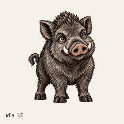
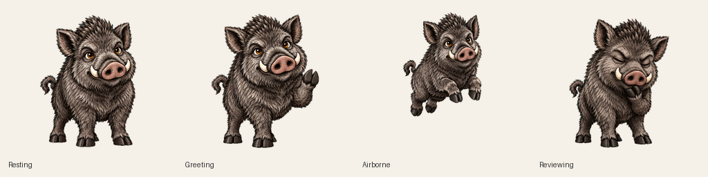

# Кабанчик

Любопытный маленький кабан для рабочего пространства. Тёмная щетина, янтарные глаза, светлые клыки и решительный настрой на следующую задачу.

[English](README.md) · [Спрайт-лист](assets/kabanchik.png) · [Видео анимаций](previews/all-states.mp4) · [Лицензия MIT](LICENSE)

## Что внутри

- Прозрачный PNG с **73 позами**: 9 анимаций и 16 направлений взгляда.
- Ожидание, бег вправо и влево, приветствие, прыжок, огорчение, запрос внимания, сосредоточенная работа и проверка результата.
- GIF-превью каждого состояния, общий GIF и MP4, переход «покой → прыжок → покой».
- [Манифест](spritesheet.json) с координатами и длительностями кадров и [промпт персонажа](prompts/character.md).

## Использование

Скачайте [assets/kabanchik.png](assets/kabanchik.png) и [spritesheet.json](spritesheet.json) или клонируйте репозиторий. Кабанчика можно использовать в совместимом проигрывателе спрайтов, игре, настольном питомце или другом проекте на условиях MIT.

Изображение размером **1536 × 2288 пикселей** состоит из **8 столбцов и 11 строк**. Размер кадра — **192 × 208**. Формат сетки соответствует ChatGPT Work Pets v2. Нумерация строк и столбцов начинается с нуля.

Кадр вырезается из прямоугольника `x = столбец × 192`, `y = строка × 208`, шириной `192` и высотой `208`. Кадры анимаций занимают ячейки слева; 15 неиспользуемых ячеек полностью прозрачны.

| Строка | Состояние | Кадров |
| --- | --- | ---: |
| 0 | Покой и моргание | 6 |
| 1 | Бег вправо | 8 |
| 2 | Бег влево | 8 |
| 3 | Приветствие | 4 |
| 4 | Прыжок | 5 |
| 5 | Огорчение | 8 |
| 6 | Ожидание ответа | 6 |
| 7 | Сосредоточенная работа | 6 |
| 8 | Проверка результата | 6 |
| 9 | Взгляд: 0° → 157,5° | 8 |
| 10 | Взгляд: 180° → 337,5° | 8 |

Направления идут по часовой стрелке: **0° — вверх, 90° — вправо на экране, 180° — вниз, 270° — влево**. У почти вертикальных промежуточных поз горизонтальное смещение небольшое. Длительности кадров указаны в манифесте.

## Превью

[Все кадры](previews/contact-sheet.png) · [Направления взгляда](previews/look-directions.png) · [Повороты головы](previews/look-loop.gif) · [Прыжок](previews/idle-jump-idle.gif)

## Как сделано

Персонаж создан в октябре 2026 года с помощью генерации изображений OpenAI и плагина Pets в Codex. Вдохновением послужила предоставленная пользователем гравюра кабана. В репозитории опубликованы сгенерированные изображения; исходная картинка-референс в него не входит. Это самостоятельный проект сообщества без аффилиации с OpenAI.

Финальный спрайт-лист прошёл проверки структуры, прозрачности, количества кадров, прыжка, расположения поз и независимую проверку направлений взгляда. Контрольные суммы лежат в [CHECKSUMS.sha256](CHECKSUMS.sha256).

## Развитие проекта

Можно присылать исправления анимаций, интеграции и сообщения о проблемах. При изменении рисунков сохраняйте узнаваемость персонажа и прозрачные поля ячеек, добавляйте превью до и после. При замене файлов обновляйте манифест и контрольные суммы.

## Лицензия

[MIT](LICENSE) для материалов этого репозитория. Изображения созданы с помощью ИИ.
